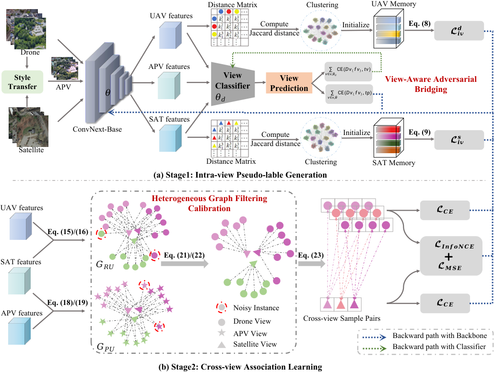

# UniABG

<p align="center">
  <b>Unified Adversarial View Bridging and Graph Correspondence for Unsupervised Cross-View Geo-Localization</b>
</p>

<p align="center">
  <b>AAAI 2026 Oral</b>
</p>

<p align="center">
  <a href="https://ojs.aaai.org/index.php/AAAI/article/view/37272">Paper</a> |
  <a href="https://arxiv.org/abs/2511.12054">arXiv</a>
</p>

**Cuiqun Chen, Qi Chen, Bin Yang, Xingyi Zhang**

[Overview](#overview) · [Installation](#installation) · [Training](#training) · [Evaluation](#evaluation) · [Citation](#citation)

## Overview

This repository provides the official PyTorch implementation of **UniABG**, a dual-stage framework for **unsupervised cross-view geo-localization (UCVGL)**.

Unsupervised CVGL is mainly challenged by two tightly coupled issues: the substantial appearance gap between UAV and satellite views, and noisy cross-view correspondences induced by unreliable pseudo labels. UniABG addresses them in two stages:

1. **View-Aware Adversarial Bridging (VAAB)** introduces an Auxiliary Pseudo View (APV) as a transitional domain between UAV and satellite imagery and learns view-invariant representations through three-view adversarial learning.
2. **Heterogeneous Graph Filtering Calibration (HGFC)** exploits heterogeneous neighborhood consistency and high-confidence cross-view matching to filter noisy associations and construct more reliable cross-view training pairs.

<p align="center">
  <a href="assets/framework.pdf"></a>
</p>

## Highlights

- **Fully unsupervised cross-view learning** without paired cross-view annotations.
- **VAAB** reduces the UAV-satellite domain gap through an auxiliary pseudo view and view-aware adversarial learning.
- **HGFC** calibrates noisy cross-view correspondences using heterogeneous graph structures and neighborhood consistency.
- The paper reports state-of-the-art unsupervised performance on **University-1652** and **SUES-200**.
- On University-1652, UniABG reaches **93.62% R@1** for Drone-to-Satellite retrieval.
- The method improves Satellite-to-Drone AP by **10.63 percentage points** on University-1652 and up to **16.73 percentage points** on SUES-200 over previous unsupervised methods.

## Repository Structure

```text
UniABG/
├── clustercontrast/             # Clustering, memory, evaluation and data utilities
├── sample4geo/                  # Backbone, losses and retrieval utilities
├── cluster_train_university.py  # UniABG clustering / association training on University-1652
├── cluster_train_sues200.py     # UniABG clustering / association training on SUES-200
├── train_university.py          # Cross-view training / evaluation on University-1652
├── train_sues200.py             # Cross-view training / evaluation on SUES-200
├── eval_university.py           # University-1652 evaluation
├── eval_sues.py                 # SUES-200 evaluation
├── university_train.sh          # University-1652 training pipeline
├── sues_train.sh                # SUES-200 training pipeline
├── requirements.txt
└── LICENSE
```

The core graph-based correspondence calibration is implemented in `graph_filtering()` in `cluster_train_university.py` and `cluster_train_sues200.py`. The view classifier used by the adversarial bridging stage is implemented under `clustercontrast/models/`.

## Installation

Clone the repository and enter its root directory:

```bash
git clone https://github.com/chenqi142/UniABG.git
cd UniABG
```


We recommend creating an isolated Python environment first.

```bash
conda create -n uniabg python=3.11 -y
conda activate uniabg
```

The released dependency file is an environment snapshot. Review the compatibility notes below and resolve the platform-specific packages before using:

```bash
pip install -r requirements.txt
```

> **Environment note.** The snapshot pins PyTorch `2.7.0+cu118` and TorchVision `0.22.0+cu118`, includes `faiss_gpu==1.7.2`, and lists two conflicting PyYAML versions (`6.0.2` and `6.0.3`). Resolve the duplicate PyYAML pin and select compatible CUDA, FAISS, NumPy and augmentation-library versions for your platform. Installing PyTorch first does not override the pins in this file. The environment snapshot is not a validated, portable installation recipe.

## Datasets

### University-1652

Download University-1652 from its official repository:

- https://github.com/layumi/University1652-Baseline

The code expects the standard University-1652 organization, including:

```text
University-Release/
├── train/
│   ├── drone/
│   └── satellite/
└── test/
    ├── query_drone/
    ├── gallery_satellite/
    ├── query_satellite/
    └── gallery_drone/
```

### SUES-200

Download SUES-200 from the official benchmark repository:

- https://github.com/Reza-Zhu/SUES-200-Benchmark

The repository contains the corresponding SUES-200 data loaders and split utility under:

```text
clustercontrast/datasets/SUES-200/
sample4geo/dataset/SUES-200/
```

## Training

**Before running:** complete the [reproduction setup](#important-reproduction-note), including local data and device paths. Both dataset pipelines run the two stages described in the paper.


### University-1652

The provided shell script follows the released training pipeline:

```bash
bash university_train.sh
```

Equivalent commands:

```bash
python cluster_train_university.py
python train_university.py
```

### SUES-200

For example, at 300 m:

```bash
bash sues_train.sh
```

Equivalent commands:

```bash
python cluster_train_sues200.py --altitude 300
python train_sues200.py --altitude 300
```

The supported altitude settings are `150`, `200`, `250`, and `300`.

### Important Reproduction Note

This repository preserves the original research code used for the experiments. Several scripts still contain the authors' local absolute paths for datasets, logs, GPUs, and checkpoints. **Please replace these paths with your own environment before running.**

Both `cluster_train_university.py` and `cluster_train_sues200.py` follow the full method in the paper:

1. `main_worker_stage1_intra_view(args)` performs intra-view pseudo-label generation with view-aware adversarial bridging.
2. `main_worker_stage2_inter_view(args)` loads `model_best.pth` from `args.logs_dir` and performs cross-view association learning with graph-based calibration.

Run the stages in this order when training from scratch. To resume directly from Stage 2, first provide a compatible Stage-1 checkpoint in the same log directory.

Configure dataset roots, `args.logs_dir`, GPU IDs and device settings consistently across clustering, subsequent training and evaluation. The log-directory option is spelled `--logs-dir` in `cluster_train_university.py` and `--logs_dir` in `cluster_train_sues200.py`. Some GPU options use tuple parsing; inspect their defaults before changing them.

Pretrained UniABG checkpoints are **not included** in the current repository release.

## Evaluation

University-1652 evaluation:

```bash
python eval_university.py
```

SUES-200 evaluation:

```bash
python eval_sues.py
```

Before evaluation, set the checkpoint and dataset paths in the corresponding script to your local files.

## Method Components in the Code

| Paper Component | Main Code Location |
|---|---|
| Intra-view pseudo-label generation | `cluster_train_university.py`, `cluster_train_sues200.py` |
| View-aware adversarial learning | `clustercontrast/trainners.py`, `clustercontrast/models/` |
| APV / style-transfer related processing | `clustercontrast/utils/data/` and training pipeline |
| Jaccard-distance clustering | `clustercontrast/utils/faiss_rerank.py` |
| HGFC / graph filtering | `graph_filtering()` in `cluster_train_*.py` |
| Cross-view contrastive learning | `sample4geo/loss/`, `train_*.py` |

## Citation

If you find this work useful, please cite:

```bibtex
@inproceedings{chen2026uniabg,
  title     = {UniABG: Unified Adversarial View Bridging and Graph Correspondence for Unsupervised Cross-View Geo-Localization},
  author    = {Chen, Cuiqun and Chen, Qi and Yang, Bin and Zhang, Xingyi},
  booktitle = {Proceedings of the AAAI Conference on Artificial Intelligence},
  volume    = {40},
  number    = {4},
  pages     = {2823--2831},
  year      = {2026},
  doi       = {10.1609/aaai.v40i4.37272}
}
```

## Acknowledgements

This implementation builds on open-source cross-view geo-localization and contrastive-learning codebases, including components adapted from Sample4Geo-style retrieval pipelines and clustering-based unsupervised representation learning. We thank the authors of the related datasets and open-source projects.

## License

The code is released under the [Apache License 2.0](LICENSE). Datasets and third-party components remain subject to their respective licenses.
